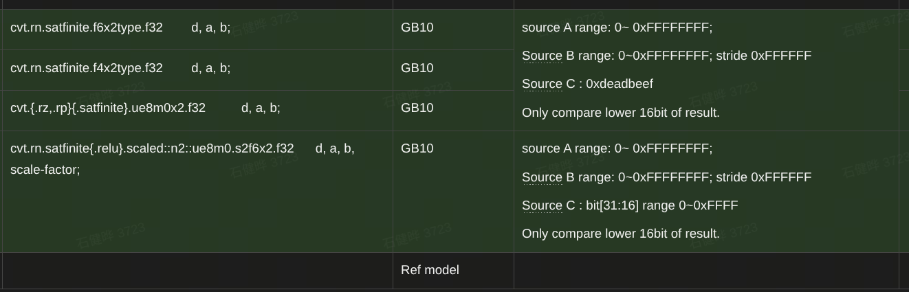
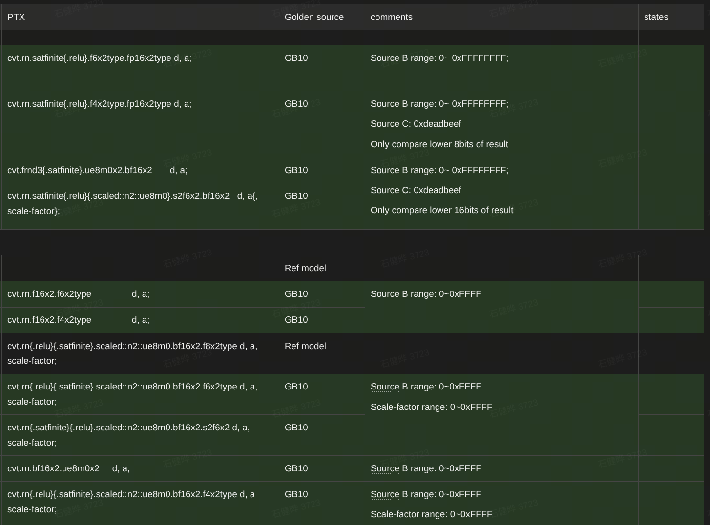
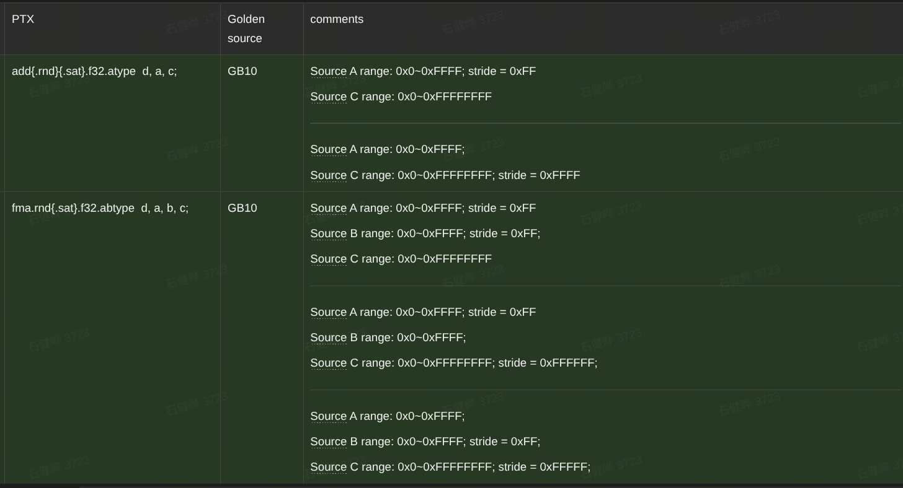

# README





```bash
cd /home/jianyeshi/Note/PTX-Instruction-Accuracy-Test/sm121-GB10

# 查看全部 85 条指令
./run_gb10_ptx_accuracy.py --list

# GB10 上执行 smoke
./run_gb10_ptx_accuracy.py

# 完整范围分片
./run_gb10_ptx_accuracy.py \
  --profile full \
  --shard-count 16 \
  --shard-index 0 \
  --yes-large

# 与参考结果自动比较
./run_gb10_ptx_accuracy.py \
  --reference-dir /path/to/reference/results
```
